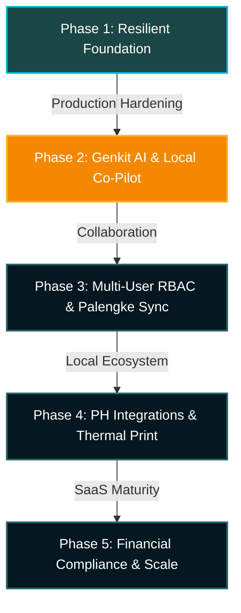
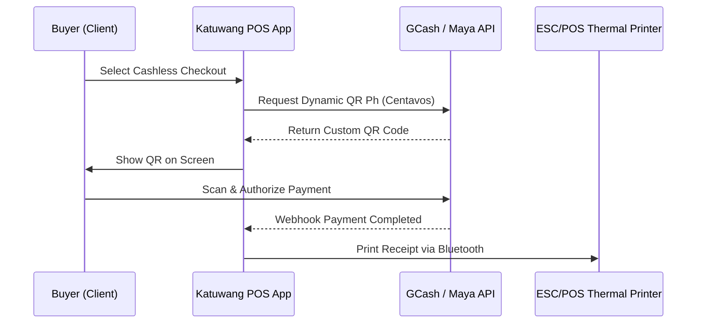

# 🗺️ Katuwang Solutions: Production & Scale Roadmap

Katuwang Solutions is built to be the premier mobile-first, multi-tenant SaaS framework for Filipino MSMEs (*Ang Katuwang mo sa Negosyo*). Standard software architectures often fail in low-bandwidth, fast-paced retail hubs like open-air wet markets (*palengke*), local transport terminals, and sari-sari stores. This roadmap outlines how we harden, scale, and enrich the Katuwang ecosystem.

---

## 🏛️ Current Architectural Achievements (Phase 1)
We have successfully developed the core engine architecture, which stands as a robust, production-hardened foundation:
*   **Isolation Shield Architecture:** Strict tenant segregation using dynamic sub-collection routing in Firestore, ensuring that customer financial ledgers and product catalogs never bleed between business profiles.
*   **Resilient Transaction Engine:** An offline-first transaction architecture (`runTransactionResilient`) that queues inventory updates and sales logs when network signal drops, syncing instantly once reconnected.
*   **Mobile-First Custom UI Design:** Fully-custom bottom navigation shell, swipe carousels, and 48px touch targets tailored for compact viewports under active sunlight.
*   **Universal SnapDate Component:** One-handed calendar grid designed for active, high-velocity shopkeepers.

---

## 🚀 The Multi-Phase Roadmap

### 🟠 Phase 2: Genkit AI & Local Business Co-Pilot (Near Term)
Filipino micro-merchants don't need complex charting tools; they need direct, actionable advice in local dialects.

*   **Genkit-Powered Business Assistant ("Katuwang AI"):**
    *   Integrate a Gemini-backed Genkit flow that analyzes Firestore transaction patterns (`sales` and `inventory` collections) directly inside the user's tenant context.
    *   Deliver insights using simplified conversational Tagalog/Cebuano/Hiligaynon rather than financial jargon.
    *   *Example Prompt/Response:* `"Ate, paubos na po ang saging sa Fresh Tally. Noong nakaraang linggo, mabilis itong naubos pagdating ng Huwebes. Mag-order po ba kayo uli kay Kuya Ruben?"`
*   **Smart Purchase Order Generator:**
    *   Autogenerate text-message (SMS) or Viber ordering sheets using local language, letting the user share it directly with wholesalers via mobile share sheets.
*   **Visual Voice Search:**
    *   Enable voice-based lookups for inventory items using natural language (e.g., *"Meron pa ba tayong gata?"* or *"Magkano ang natitirang asukal?"*).

---

### 🟢 Phase 3: Multi-User RBAC & Palengke Sync Hardening (Medium Term)
Most local small businesses are family-run or depend on hired helpers (*tindero/tindera*).

*   **Tindera Access Controls (RBAC):**
    *   Introduce limited member invites. The *Owner* (`ownerUid`) retains master access to subscription controls, profit sheets, and deletion privileges.
    *   The *Helper* account receives a specialized viewport: they can check out carts, scan stock, and record expenses, but cannot view total store net margins or delete records.
*   **Visual Offline Sync Center:**
    *   Add a header badge showing connection health (`online` / `offline` / `syncing`).
    *   Build a compact "Pending Uploads" drawer listing transactions cached in IndexedDB, giving users transparency that their records are safe.
*   **Conflict Resolution Engine:**
    *   In a multi-device setup where a store owner and their helper both perform transactions offline, implement conflict policy logic (e.g., atomic inventory merges rather than last-write overwrite).

---

### 🔵 Phase 4: PH Integrations & Hardware Enablement (Long Term)
Integrating with the native mobile workspace to streamline physical sales.

*   **Philippine Local Payments (GCash, Maya, QR Ph):**
    *   Integrate standard Philippine payment aggregators (e.g., PayMongo, Xendit) or direct dynamic QR Ph generation.
    *   Automatically convert transactions (stored in integer centavos) into PHP payment requests.
    *   Generate on-screen dynamic QR codes that customer phones can scan instantly.
*   **Bluetooth receipt printing (ESC/POS):**
    *   Add support for cheap 58mm wireless Bluetooth thermal printers commonly used in retail stalls.
    *   Build a Web Bluetooth driver to print mini-receipts with customized headers (*"Salamat sa Pagtangkilik!"*).
*   **Bar/QR Code Scanning via Native Camera:**
    *   Implement high-speed continuous camera scanning in browser shells so shopkeepers can scan physical barcodes for instant cart additions without purchasing expensive scanning guns.

---

### 🟣 Phase 5: Financial Compliance & Scale (Enterprise & SaaS Maturity)
Expanding from a single merchant helper to a certified tax and billing engine.

*   **Sari-Sari micro-credit tracker ("Hiram Snap" Ledger):**
    *   Formalize the customer credit (*lista*) module. Enable automatic SMS notifications to customers when their debt reaches a customized limit.
*   **BIR-Ready Sales Ledger Export:**
    *   A one-tap feature that organizes raw transaction history into a standard BIR (Bureau of Internal Revenue) simplified ledger template, saving local merchants hours of manual bookkeeping.
*   **Multi-Store Dashboard (Cooperative / Franchise Tier):**
    *   For growing local networks, introduce a centralized enterprise view dashboard aggregating metrics across multiple geographic locations.

---

## 📊 Summary of Technical Priorities

| Feature Area | Technical Dependencies | Value to MSMEs | Complexity |
| :--- | :--- | :--- | :--- |
| **Tagalog AI Assistant** | Genkit, Gemini 1.5 Flash, Firestore vectors | Low-literacy accessibility, predictive alerts | High |
| **Tindera Role System** | Firestore Security Rules, custom claims | Secure employee operations, fraud prevention | Medium |
| **Offline Sync Center** | Service Workers, IndexedDB API, standard Firestore persistence | Reassurance in spotty palengke environments | Medium |
| **QR Ph Checkout** | Payment gateway REST APIs, Canvas QR rendering | Frictionless, cash-free mobile transactions | Medium |
| **Bluetooth printing** | Web Bluetooth API, ESC/POS byte-streams | Professional, physical receipt hand-offs | High |
